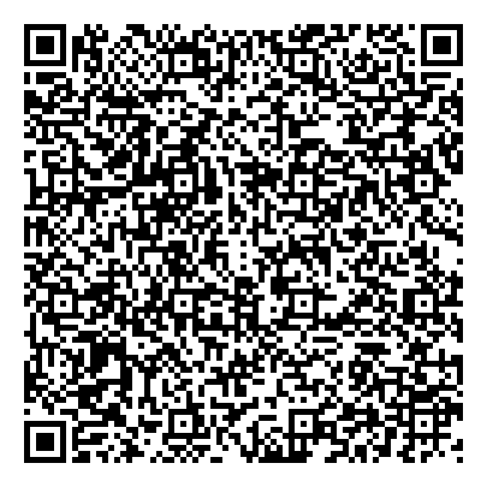
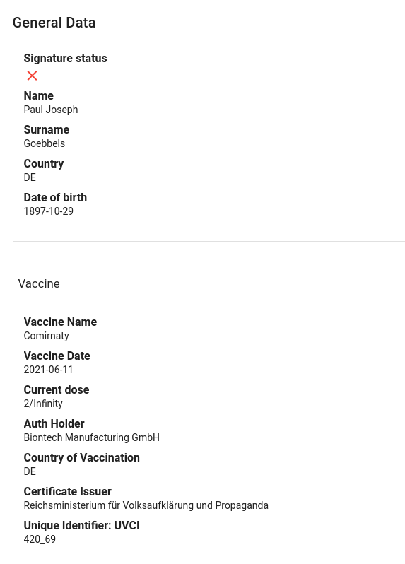

# Covid1984 Green Pass

Just for fun. No fraud intended :ghost:

Use the decoder notebook to decode your QR-code and display the stored information.

Use the encoder notebook to encode your data into a custom QR-code.

### Important note

I thought the following would be obvious to everyone, but considering the amount of people who reached out to me privately, apparently it's not.

I posted this code just for education purposes, it can create plausible Green Pass QRs in a (mostly) correct format which are parsed correctly by the checker apps (at least the ones I tried) but obviously **no one but who has one of the "authorized" key pairs** will ever be able to generate valid signatures.

It's cryptography, there's no magic trick. You can see also in the example image that the signature verification fails.

'
<strong>Schema version</strong>:1.3.0

<strong>Date of birth</strong>:1999-03-11

<strong>Surname(s), forename(s)</strong>

&nbsp;<strong>Surname</strong>:Diks

&nbsp;<strong>Standardised surname</strong>:DIKS

&nbsp;<strong>Forename</strong>:Celine

&nbsp;<strong>Standardised forename</strong>:CELINE

<strong>Vaccination Group</strong>

&nbsp;<strong>disease or agent targeted</strong>:840539006

&nbsp;<strong>vaccine or prophylaxis</strong>:J07BX03

&nbsp;<strong>vaccine medicinal product</strong>:EU/1/20/1525

&nbsp;<strong>Marketing Authorization Holder</strong>:ORG-100001417

&nbsp;<strong>Dose Number</strong>:1

&nbsp;<strong>Total Series of Doses</strong>:1

&nbsp;<strong>ISO8601 complete date: Date of Vaccination</strong>:2021-07-06

&nbsp;<strong>Country of Vaccination</strong>:NL

&nbsp;<strong>Certificate Issuer</strong>:Ministry of Health Welfare and Sport

&nbsp;<strong>Unique Certificate Identifier: UVCI</strong>:URN:UCI:01:NL:OOAOUJ2LTFDLJEDST2VY42#I
'